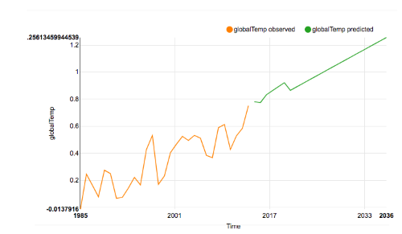

## {{page.title}}

In this particular case, the end of the story is that I needed to get rid of some zeroes, but let me step back.

One of my colleagues outside Engineering sent me a small data-set and claimed that while it should be rather simple to forecast a result, he was finding it wasn't working properly in the Nexosis API. The data set was [an analysis of global warming over the last 138 years](https://data.giss.nasa.gov/gistemp/) through temperature variances, CO2 levels and the number of sun spots. The data comes with some predictions already made, making it a good test case. 


*https://commons.wikimedia.org/wiki/File:Global_Warming_Predictions.png*

While 'simple' is sometimes an invitation to spend days figuring out the data, I cheated and asked one of our data scientists to try and get a quick result from the data set that matched the expectations represented in the graph above. She dug into the data while I moved on to something else. While I've studied plenty and learned a lot about machine learning in my time at Nexosis I am still very much more the developer I was when I started than I am a data scientist. In any case, turns out it **was** simple and she gave me back results very quickly.

OK - so why wasn't the API finding it simple too? If you're thinking I wouldn't write a post about how our API didn't work - you're right. But the answer wasn't as straightforward to our internal user or myself as I thought it should be - and that's worth writing about.

### Know Your Data
The thing is, no matter how simple we can make it to work with machine learning algorithms, a big factor in a user's success is the quality of the data and giving our API some information about how best to work with it. That presented a problem here as I didn't know this data, nor had I spent enough time to get familiar with it. Let's take a quick look at the data. Here's the first 10 years...

``` csv
timeStamp,globalTemp,co2PpmMean,sunspotsSum
1880-01-01 00:00:00Z,-0.4700088,,53.7
1881-01-01 00:00:00Z,-0.3568788,,90.5
1882-01-01 00:00:00Z,-0.3726612,,99
1883-01-01 00:00:00Z,-0.448443,,106.1
1884-01-01 00:00:00Z,-0.5897538,289.81,105.8
1885-01-01 00:00:00Z,-0.6636546,289.01,86.3
1886-01-01 00:00:00Z,-0.6439392,290.62,42.4
1887-01-01 00:00:00Z,-0.7616232,,21.8
1888-01-01 00:00:00Z,-0.5166342,,11.2
1889-01-01 00:00:00Z,-0.4717926,291.87,10.4
```
So we have averages of variance in temperature, a Co2 PPM reading, and a sum of sun spots given on a yearly basis. I had been told by my colleague that Co2 was an important factor but sun spots was not. This means we'll use Co2 as a feature when we go to forecast the data.

This is perhaps a good start, but I still didn't know the data set well enough so here's what I did and where I went wrong.

### First Run of a Forecast

I opened up the Ruby Sample app I use (and which is [available to anyone](https://github.com/Nexosis/samples-rb/tree/master/ruby_forecast_app)) to load data and visualize predictions from the Nexosis API. I uploaded the given CSV data as "EnvironmentData". I needed to then set the Co2 readings as a feature. If you're not familiar with that term or concept it's perhaps simple enough to say that this is a measure which we believe will have an influence on the variable we want to predict. We're predicting globalTemp, but think that if we analyze co2PpmMean we'll find a better basis for a good forecast. Selecting a feature also means that we have to provide that feature into the future when we forecast - so choosing something you don't have predictions for can be limiting. 

In any case, I started a session as shown below:


The data set has Co2 predictions running through 2040, so my prediction request ends there instead of at 2100 as in the displayed graph.

### Results
The result of this run was underwhelming. In the graph below you can see that the Nexosis API picked up on the last trend starting in 2015 and just ran that slope out forever. 


To get an indication of why this is a bad result note that this is a prediction of a +4&deg;C change by the year 2040! Even the rather concerning results of NOAA above don't get to 4&deg;C until after 2100. Clearly something went wrong. 

### Really, Know Your Data
To solve the problem I had to take a closer look at the data. Perhaps you didn't skip over the CSV as I did and you actually noticed that the co2PpmMean data in the 1800's had a lot of missing values. Missing values are a problem for machine learning algorithms. Nexosis helps you out here by filling in missing values. This is necessary because an N/A or null in a value when you're do calculations is a non-starter. The issue in this case is with the default for the Nexosis API which treats any column filled with numbers as "numeric" data type - and treats all numerics as summable values. What this means is that when we choose how to fill in those values (imputation is the data science term) the API will use zeroes. So now we get to why I titled this article as I did. Zeroes are not a good choice for a value like temperature, Co2 readings, or indeed any value which isn't naturally zero when not observed. By contrast a number like "daily sales" may be very well represented by a zero; perhaps no reading means that a store or cash register wasn't open during that time period. But a missing Co2 reading is not likely going to zero.

Thankfully, the Nexosis API allows us to change the imputation strategy - and in this case we can actually just change the data type and get different defaults for imputation. The picture below is again from the [Ruby Sample App](https://github.com/Nexosis/samples-rb/tree/master/ruby_forecast_app). Note that the co2PpmMean column now has a datatype of *Measure* and the imputation is now set to *Mean*.  This is telling the Nexosis API to fill missing values in the dataset with the mean of all observations instead of zeroes.


If you want to set metadata directly via the API you use the columns object in json:
``` json
 "columns": {
        "timeStamp": {
            "dataType": "date",
            "role": "timestamp",
            "imputation": null,
            "aggregation": null
        },
        "co2PpmMean": {
            "dataType": "numericmeasure",
            "role": "feature",
            "imputation": "mean",
            "aggregation": "mean"
        },
        "globalTemp": {
            "dataType": "numericmeasure",
            "role": "target"
        },
        "sunspotsSum": {
            "dataType": "numericmeasure",
            "role": "none"
        }
    }
```
### Try Again
With a different definition for our data types I can simply run another session with the same parameters as before. This time the result is more satisfying:



Now we see about +1.26&deg;C change by the year 2040 which matches much better with the reference graph above. That's the difference between sea level problems in 2100 and the Earth catching fire in 2100. Getting rid of those zeroes was really important! 

The lesson then is that 
